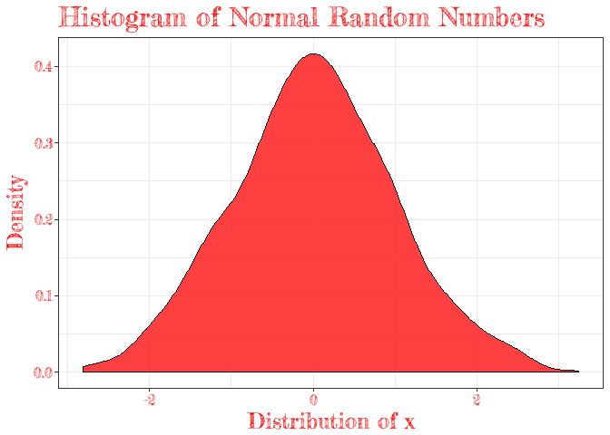

<!-- README.md is generated from README.Rmd. Please edit that file -->
ReferenceSheetsForR
===================

This repository contains Documents for future reference.

As I come across a task or issue with a useful solution, this is where I store the results.

Individual files are stored in [/Documents](https://github.com/JMLuther/ReferenceSheetsForR/tree/master/Documents)

Examples
========

Non-standard Fonts
------------------

How to import Google fonts and add to ggplot

Sparklines
----------
